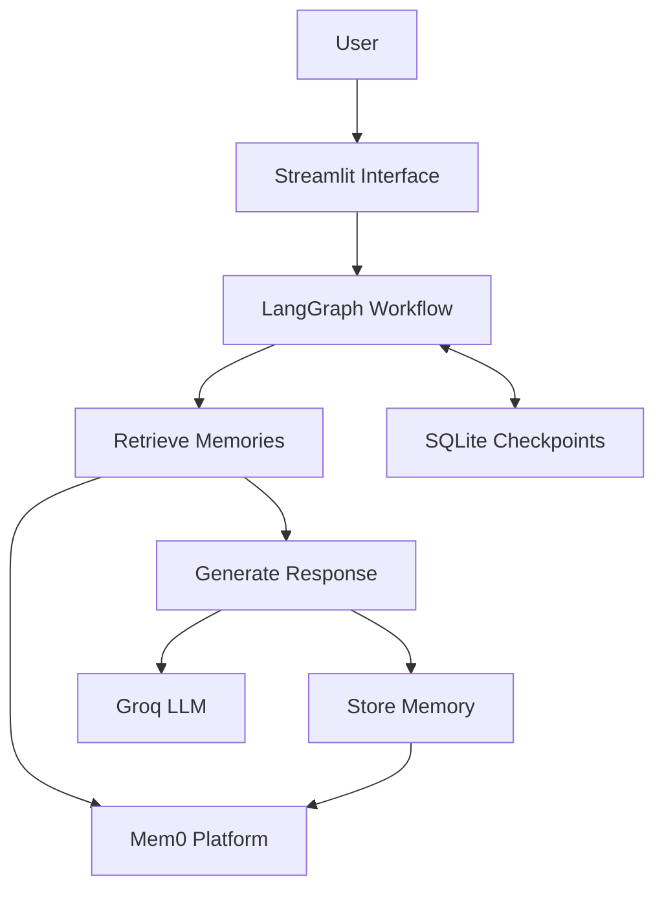

# RecallCoach AI

A personalized learning coach demonstrating thread-level short-term memory with LangGraph and cross-conversation long-term memory with Mem0.


## Project Overview

RecallCoach AI is a stateful learning assistant that remembers both the current conversation and durable information about the learner.

The project demonstrates two intentionally separate memory layers:

- **LangGraph with SQLite** preserves complete conversation state within a specific thread.
- **Mem0 Platform** extracts and retrieves useful user information across different conversation threads.

> SQLite remembers the conversation. Mem0 remembers the person.

## Application Preview

### Persistent conversation history


### Cross-thread personalization


## Key Features

- Stateful conversational workflow built with LangGraph
- Persistent SQLite checkpoints for thread-level memory
- Mem0-powered long-term memory across conversations
- Semantic retrieval of relevant user preferences and learning history
- Separate `thread_id`, `run_id`, and `user_id` memory scopes
- Groq-hosted language model for response generation
- Streamlit chat interface
- Conversation switching without losing user-level memory
- Long-term memory inspection and targeted deletion
- Graceful fallback when Mem0 retrieval is unavailable
- Environment-based secret management

## Architecture



## LangGraph Workflow


The workflow contains three focused nodes:

1. **Retrieve memories** — searches Mem0 using the current message and trusted user scope.
2. **Generate response** — combines relevant memories with checkpointed conversation history.
3. **Store interaction** — submits the latest user-assistant exchange to Mem0.

## Memory Architecture

| Memory layer | Scope | Identifier | Purpose |
|---|---|---|---|
| LangGraph `SqliteSaver` | One conversation | `thread_id` | Conversation continuity and restart persistence |
| Mem0 Platform | One user across conversations | `user_id` | Preferences, goals, difficulties and learning progress |
| Mem0 run metadata | Source conversation | `run_id` | Identifies which thread produced a memory |

When storing memories:

```text
user_id = demo-user
run_id  = current LangGraph thread_id
```

When retrieving memories:

```text
filters = {"user_id": "demo-user"}
```

Searching by `user_id` without restricting `run_id` enables useful information to move across conversation boundaries.

## Example Behaviour

### First conversation: `python-basics`

```text
User:
I am learning Python decorators. I prefer explanations using
real-world analogies and short code examples.
```

SQLite stores the conversation under `python-basics`. Mem0 may extract:

```text
User is learning Python decorators.
User prefers explanations using real-world analogies.
User prefers short code examples.
```

### Second conversation: `sql-practice`

```text
User:
Teach me the difference between INNER JOIN and LEFT JOIN.
```

The new thread does not contain the Python conversation history. However, Mem0 can retrieve the explanation preferences and personalize the SQL lesson.

## Technology Stack

| Technology | Responsibility |
|---|---|
| Python | Application language |
| LangGraph | Stateful workflow orchestration |
| LangGraph `SqliteSaver` | Persistent short-term memory |
| Mem0 Platform | Managed long-term memory |
| Groq | Language-model inference |
| Streamlit | Interactive frontend |
| python-dotenv | Local environment configuration |

## Project Structure

```text
langgraph-mem0-learning-coach/
├── assets/
│   ├── short-term-memory.png
│   └── cross-thread-memory.png
├── data/
│   └── checkpoints.sqlite
├── app.py
├── config.py
├── graph.py
├── memory_service.py
├── requirements.txt
├── .env.example
├── .gitignore
└── README.md
```

The `data` directory and SQLite database are generated locally and excluded from Git.

## Setup

### 1. Clone the repository

```bash
git clone https://github.com/YOUR_USERNAME/langgraph-mem0-learning-coach.git
cd langgraph-mem0-learning-coach
```

### 2. Create a virtual environment

Windows PowerShell:

```powershell
py -3.13 -m venv .venv
.venv\Scripts\Activate.ps1
```

macOS or Linux:

```bash
python3 -m venv .venv
source .venv/bin/activate
```

### 3. Install dependencies

```bash
python -m pip install --upgrade pip
pip install -r requirements.txt
```

### 4. Configure environment variables

Copy `.env.example` to `.env` and add your credentials:

```env
GROQ_API_KEY=your_groq_api_key
MEM0_API_KEY=your_mem0_api_key
GROQ_MODEL=openai/gpt-oss-120b
MEM0_USER_ID=demo-user
```

Never commit the completed `.env` file.

### 5. Run the application

```bash
streamlit run app.py
```

Open:

```text
http://localhost:8501
```

## Memory Controls

The Streamlit sidebar provides:

- thread creation and switching;
- current user and thread visibility;
- long-term memory inspection;
- targeted memory deletion;
- confirmed deletion of all demo-user memories.

Mem0 processes additions asynchronously, so newly extracted memories may take several seconds to appear.

## Manual Evaluation

| Test | Expected result |
|---|---|
| Same-thread recall | The agent recalls earlier messages in the current thread |
| Restart persistence | Conversation history survives application restart |
| Cross-thread recall | A new thread retrieves relevant user preferences |
| Retrieval relevance | Unrelated memories do not control the answer |
| Memory inspection | Stored facts and memory IDs are visible |
| Targeted forgetting | A deleted memory stops appearing |
| Graceful fallback | The coach still responds if Mem0 search fails |
| Secret protection | API keys and local databases remain outside Git |

## Engineering Decisions

### Why SQLite?

SQLite provides simple persistent checkpointing for a local, single-user demonstration. A multi-instance production deployment would require a shared production database such as PostgreSQL.

### Why Mem0 Platform?

Mem0 Platform provides managed extraction, embedding, storage and retrieval. This keeps the project focused on memory orchestration rather than vector-database infrastructure.

### Why separate memory systems?

Conversation history and durable user knowledge have different scopes:

- replaying an entire transcript across every conversation is inefficient;
- storing every message as permanent user knowledge creates noisy retrieval;
- separate layers allow the application to retrieve only relevant long-term facts.

### Why only store the latest interaction?

Submitting only the latest completed exchange avoids repeatedly processing the entire conversation and reduces unnecessary memory requests.

## Safety and Limitations

- The application uses a fixed `demo-user` identity and does not implement authentication.
- SQLite is intended for this local prototype, not concurrent cloud deployment.
- Mem0 is an external managed service and may be temporarily unavailable.
- Retrieved memories are treated as untrusted context, not executable instructions.
- Current user statements override conflicting stored memories.
- Do not test the application with secrets or sensitive personal information.

## Future Production Improvements

A production version could add:

- authenticated user identity;
- PostgreSQL checkpointing;
- idempotent memory-write events;
- background memory processing;
- structured logging and monitoring;
- automated memory-quality evaluation.

These features are intentionally excluded from this focused prototype.

## What This Project Demonstrates

- Stateful agent development with LangGraph
- Persistent checkpoint management
- Long-term memory integration with Mem0
- Semantic retrieval and prompt-context construction
- Memory scoping across users and conversations
- Memory lifecycle controls
- External API failure handling
- Clear separation of orchestration, generation and persistence